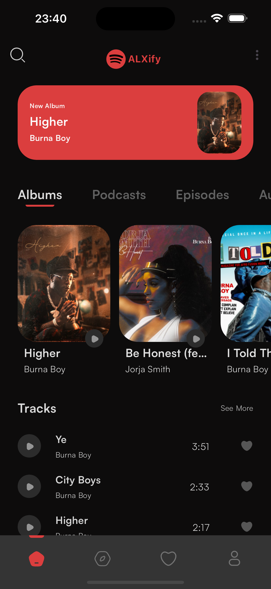
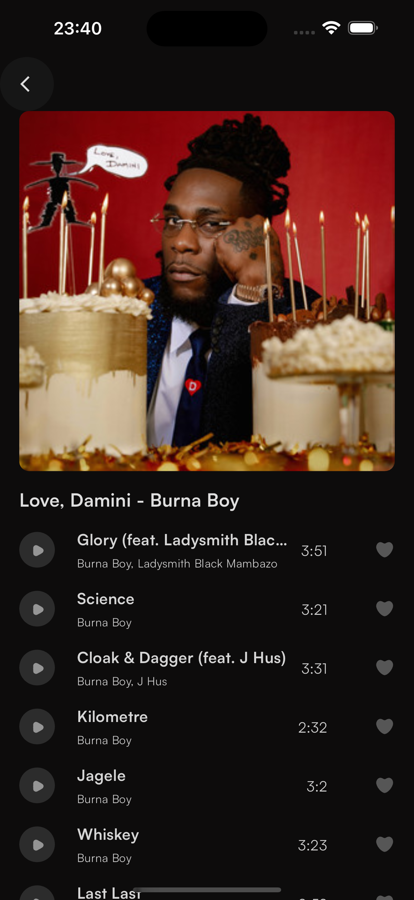
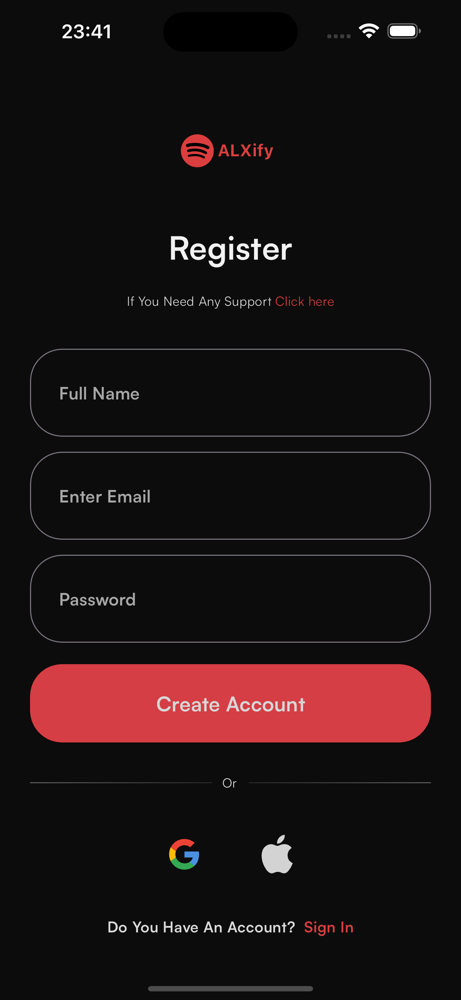
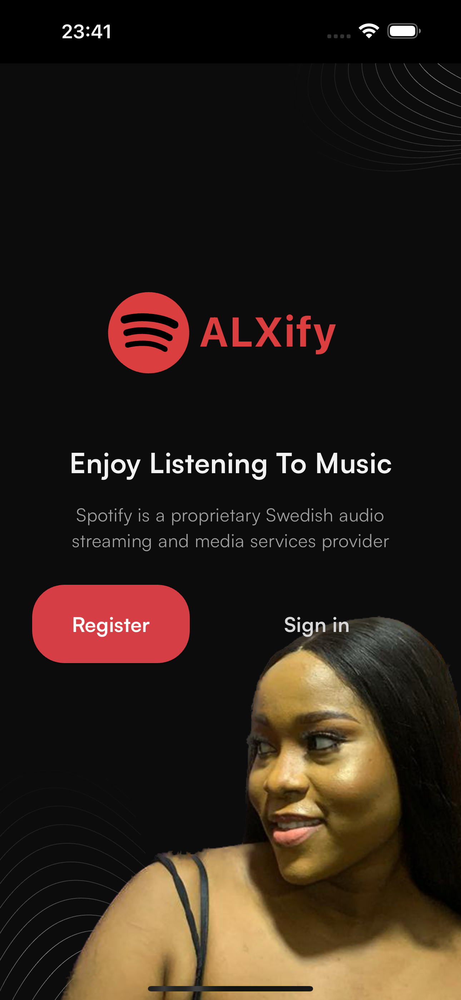

# ALXify
Alxify is a redesigned spotify mobile app clone built with flutter.

## Project Architecture and Folder Structure
This project uses the MVC (Model View Controller) architecture , where the application was divided into 3 major components which are the : Services (Model), UI (view), and Providers (controllers). This approach helped to separate the project into 3 independent components to foster maintainability , robustness and testability. It uses the Layer-first approach to structure the project.

## Setup Instructions
**Prerequisites:**

**Flutter SDK**: Download and install the Flutter SDK following the official guide: https://docs.flutter.dev/get-started/install. Ensure the installation path is added to your system's PATH environment variable for easy access from the command line.
**Dart development environment (optional)**: While not strictly necessary, using an IDE like Android Studio, IntelliJ IDEA with the Flutter plugin, or Visual Studio Code with the Flutter extension can significantly enhance your development experience. These IDEs provide features like code completion, debugging, and hot reload.

1. Open your terminal and clone the project
```bash
git clone https://github.com/callmhejerry/Alxify.git
```
2. Cd into the directory
```bash
cd Alxify
```
3. run the code
```bash
flutter run
```

## Project Screenshots









